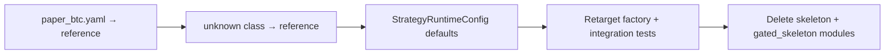

# Aggressive cleanup: dead code, stubs, and outdated docs

**Short answer:** Yes. After Phase 1–2 refactors, the repo still carries phase-proof stubs, backward-compat aliases, unwired config fields, and historical docs. An aggressive pass is justified — but **stub retirement must be migration-first** (profiles + factory fallback + tests), not delete-first.

---

## What to delete now (zero behavioral risk)

These symbols have **no callers** outside their definition:

| Symbol | File |
|--------|------|
| `journal_path_journal()` | [`src/nautilus_zerodte/approval/handlers.py`](src/nautilus_zerodte/approval/handlers.py) |
| `ib_call_instrument_id()` | [`src/nautilus_zerodte/strategies/selectors/ib.py`](src/nautilus_zerodte/strategies/selectors/ib.py) |
| `DiversificationConfig.to_policy()` | [`src/nautilus_zerodte/config/strategy.py`](src/nautilus_zerodte/config/strategy.py) |

**Docs to delete outright:**
- [`docs/faq/README.md`](docs/faq/README.md) — not a FAQ; it's an AI "Book Architect" meta-prompt (95 lines, zero repo value)

**Config orphan (never loaded by loader):**
- [`configs/risk/conservative.yaml`](configs/risk/conservative.yaml) — `load_config()` only merges `risk/default.yaml`; no profile references this file. Either **delete** or wire via a `risk_overlay` key (recommend delete unless you plan policy-maker profiles soon).

---

## What to simplify (shrink, update callers)

### Compat aliases left over from Phase 1–2

| Alias | Action |
|-------|--------|
| `ApprovalThresholds = ApprovalConfig` in [`approval/classifier.py`](src/nautilus_zerodte/approval/classifier.py) | Remove alias; update [`tests/unit/test_selector.py`](tests/unit/test_selector.py) and [`approval/__init__.py`](src/nautilus_zerodte/approval/__init__.py) to use `ApprovalConfig` |
| `_strike_price()` in [`selectors/ib.py`](src/nautilus_zerodte/strategies/selectors/ib.py) + [`deribit.py`](src/nautilus_zerodte/strategies/selectors/deribit.py) | Delete wrappers; tests import `strike_price` from [`selectors/base.py`](src/nautilus_zerodte/strategies/selectors/base.py) |
| Factory `_`-prefixed re-exports in [`node/factory.py`](src/nautilus_zerodte/node/factory.py) | Point [`tests/unit/test_factory.py`](tests/unit/test_factory.py) at `node.wiring.*`; keep only public API (`build_backtest_node`, `run_backtest`, etc.) in factory |

### Duplicate selector helpers (optional in same pass)

`_quote_liquidity`, `_underlying_price`, `_strike_float` are copy-pasted between `ib.py` and `deribit.py`. Move shared versions to [`selectors/base.py`](src/nautilus_zerodte/strategies/selectors/base.py) (already has `quote_spread_liquidity`).

### Unwired schema fields (delete, don't leave zombie YAML)

| Field | Evidence | Action |
|-------|----------|--------|
| `SessionConfig.expiry_mode` | Set in YAML + tested, **never read** by resolvers/factory | **Remove** enum + field + YAML keys (`configs/session/*.yaml`, profile overrides). Expiry already comes from `market_close_utc` / `option_series_expiry_time_utc` |
| `GateContext.flatten_signal` | Set in [`strategies/base.py`](src/nautilus_zerodte/strategies/base.py), never read by [`gates/evaluator.py`](src/nautilus_zerodte/gates/evaluator.py) | Remove from context; flatten stays in strategy FSM |
| `GateContext.risk_policy_version` | Set but never evaluated | Remove from context; version stays in node-start journal |

---

## Aggressive: retire phase stubs

`skeleton` and `gated_skeleton` were vertical-slice proofs. **`reference` + `BaseZeroDteStrategy` supersede them.** Only one profile still uses a stub:

```yaml
# configs/profiles/paper_btc.yaml
strategy_class: gated_skeleton   # ← only remaining stub user
```

### Migration steps (order matters)



1. **Profile:** Change [`configs/profiles/paper_btc.yaml`](configs/profiles/paper_btc.yaml) to `strategy_class: reference` (add `reference:` block if missing — copy from `paper_spy.yaml` / `backtest_btc.yaml` pattern).
2. **Factory fallback:** In [`node/wiring/strategy.py`](src/nautilus_zerodte/node/wiring/strategy.py), change unknown `strategy_class` fallback from `gated_skeleton` → `reference` (or raise `ValueError` for strictness — recommend `reference` fallback to preserve current lenient behavior).
3. **Defaults:** In [`config/strategy.py`](src/nautilus_zerodte/config/strategy.py), change `StrategyRuntimeConfig` defaults from `skeleton` / `skeleton-001` → `reference`.
4. **Tests to update/delete:**
   - Delete [`tests/unit/test_gated_skeleton.py`](tests/unit/test_gated_skeleton.py)
   - Update [`tests/unit/test_factory.py`](tests/unit/test_factory.py): `test_unknown_strategy_class_*` expects `reference`; `test_backtest_data_configs_quote_only_for_skeleton` → use `reference` with `backtest_plumbing: true`
   - [`tests/integration/test_backtest_smoke.py`](tests/integration/test_backtest_smoke.py) `paper_btc` builds should still pass with reference
5. **Delete files:**
   - [`src/nautilus_zerodte/strategies/skeleton.py`](src/nautilus_zerodte/strategies/skeleton.py)
   - [`src/nautilus_zerodte/strategies/gated_skeleton.py`](src/nautilus_zerodte/strategies/gated_skeleton.py)
   - Remove `skeleton` / `gated_skeleton` entries from `_STRATEGY_PATHS` in [`node/wiring/strategy.py`](src/nautilus_zerodte/node/wiring/strategy.py)

**Keep:** `HumanApprovalHandler` stub (wired in selector), `LearningModule.calibrate()` stub (Phase 6 API placeholder with tests).

---

## Docs: update vs archive vs delete

### Delete
- [`docs/faq/README.md`](docs/faq/README.md) (meta-prompt)

### Archive (stop linking as active spec)
- [`.cursor/plans/0dte_implementation_plan_5c4f2990.plan.md`](.cursor/plans/0dte_implementation_plan_5c4f2990.plan.md) — all todos completed; references pre-split file tree
- [`.cursor/plans/0dte_design_gap_analysis_e26e3a0e.plan.md`](.cursor/plans/0dte_design_gap_analysis_e26e3a0e.plan.md) — historical; contradicts current Deribit-first priority

Add a one-line note at top of each: `> Historical — superseded by docs/architecture.md`. Remove active links from [`docs/design/README.md`](docs/design/README.md).

### Update (fix drift)
| File | Fix |
|------|-----|
| [`docs/architecture.md`](docs/architecture.md) | Full loader layer order (fees, diversification, streaming, session); document `node/wiring/` split |
| [`README.md`](README.md) | Add `node/wiring/`, config split modules; list all CLI commands; env vars already added in Phase 1 |
| [`.env.example`](.env.example) | Add `DRY_RUN`, `DERIBIT_TESTNET_API_KEY/SECRET` fallbacks |
| [`Makefile`](Makefile) | `make backtest` uses `paper_spy.yaml` but README uses `backtest_reference.yaml` — align to `backtest_reference.yaml` |
| [`cli/main.py`](src/nautilus_zerodte/cli/main.py) | Fix backtest docstring ("skeleton strategy" → "configured strategy profile") |
| [`docs/implementation/config-wiring.md`](docs/implementation/config-wiring.md) | Present tense; mention `node/wiring/` + config split |
| [`docs/implementation/gate-boundary.md`](docs/implementation/gate-boundary.md) | Remove Phase 2/3 handoff checklists; drop `GatedSkeletonStrategy` references |
| [`docs/design/README.md`](docs/design/README.md) | Update implementation status (Phases 1–9 done); remove stale phase rows |

### Consolidate later (not blocking)
- Merge overlapping config/wiring content between `architecture.md` and `implementation/config-wiring.md`
- Add `docs/refactoring-log.md` per original cleanup plan Step 7

---

## What NOT to delete

| Item | Why |
|------|-----|
| `node/factory.py` | Public API for CLI + integration tests |
| `config/schema.py` | Re-export shim — deleting breaks `from config.schema import AppConfig` |
| `scripts/build_catalog_fixture.py` | Used by integration tests |
| `tests/integration/test_backtest_smoke.py` | Still valuable smoke path |
| Empty `__init__.py` files | Harmless; removing saves little |
| `IngestionPlannerActor` | Optional but wired when `ingestion.enabled` |

---

## Verification

After each batch:
```bash
uv run pytest tests/unit/test_factory.py tests/unit/test_config.py tests/integration/test_backtest_smoke.py -q
uv run pytest -q   # full suite (127+ tests)
uv run nautilus-zerodte --help   # CLI unchanged
```

---

## Suggested commit split

1. `chore: remove dead symbols and compat aliases`
2. `refactor: retire skeleton/gated_skeleton strategies`
3. `chore: prune unwired config fields and orphan risk profile`
4. `docs: fix drift, delete faq meta-prompt, archive plans`
