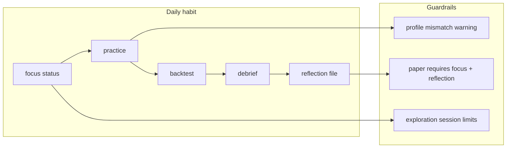

# Beginner Learning Guardrails

## Problem

The repo already journals machine events ([`runs/latest.jsonl`](runs/latest.jsonl)) but nothing forces the habits that actually teach trading:

- Pick one market and stay
- Review your own runs, not endless content
- Reflect on plan vs execution
- Measure process before P&L
- Don't pretend "building the project" equals learning

Today: backtest ends with `Journal: runs/latest.jsonl`; summary aggregates the whole file; [`paper_btc.yaml`](configs/profiles/paper_btc.yaml) uses `gated_skeleton` (gate rejects only, no fills/learning); Makefile and README disagree on defaults.

## Design principle

**One daily command** (`practice`) that cannot be skipped accidentally. Everything else supports that loop.



## 1. Focus commitment (`configs/focus.yaml`)

New small config (gitignored template + committed example):

- [`configs/focus.example.yaml`](configs/focus.example.yaml) — checked in, documents tradeoffs
- `configs/focus.yaml` — user's live file (add to [`.gitignore`](.gitignore), copy from example)

Schema (new `FocusConfig` in [`src/nautilus_zerodte/config/focus.py`](src/nautilus_zerodte/config/focus.py)):

```yaml
mode: exploration          # exploration | committed
sessions_before_commit: 5    # per candidate during exploration
primary: null                # deribit_btc | ib_spy — set on commit
candidates:
  deribit_btc:
    profile: configs/profiles/backtest_btc.yaml
    catalog: tests/fixtures/catalog_deribit
    rationale: "24/7 testnet, fixtures ready, fewer macro variables"
  ib_spy:
    profile: configs/profiles/backtest_spy.yaml
    catalog: tests/fixtures/catalog
    rationale: "Familiar real-world underlying, session-bound"
session_log: runs/focus-log.jsonl
```

**CLI: `nautilus-zerodte focus`**

| Subcommand | Behavior |
|---|---|
| `init` | Print the crypto-vs-equity tradeoff (your exact tension), write `focus.yaml` in exploration mode |
| `status` | Show mode, primary, sessions per candidate, last reflection date |
| `commit --market <id>` | Require `>= sessions_before_commit` exploration runs for that candidate; set `primary`, flip to `committed` |
| `switch --market <id> --reason "..."` | Only in `committed` mode; journal the reason; reset session counter |

This answers "I'm not sure yet" without allowing infinite drift: explore both deliberately, then commit explicitly.

## 2. Run-scoped journal slicing

**No big journal rewrite.** Add helpers in [`src/nautilus_zerodte/journal/service.py`](src/nautilus_zerodte/journal/service.py):

- `slice_runs(entries) -> list[RunSlice]` — split on `LIFECYCLE` `NODE_START`/`NODE_STOP` pairs
- `last_run(entries) -> RunSlice` — most recent complete run
- Enrich `NODE_START` payload in [`src/nautilus_zerodte/node/factory.py`](src/nautilus_zerodte/node/factory.py) with `run_id` (timestamp UUID) and `profile` path when available

All debrief/review commands default to **last run only**, not all 200 lines of `latest.jsonl`.

## 3. `journal debrief` — machine review + coaching

New command in [`src/nautilus_zerodte/cli/main.py`](src/nautilus_zerodte/cli/main.py), logic in new [`src/nautilus_zerodte/journal/debrief.py`](src/nautilus_zerodte/journal/debrief.py).

**Outputs for one run:**

| Section | Source events | Coaching line (examples) |
|---|---|---|
| Outcome | `FILL`, `PNL`, FSM final state | "Ended InPosition — did you plan an exit?" |
| Gate discipline | `GATE_REJECT` by rule | "Top block: PIN_RISK — gates did their job" |
| Learning | `LEARNING_RECORD` | edge predicted vs realized, slippage, commission |
| Execution | `ORDER_SUBMIT`, `ORDER_DENIED` | "N submits, M fills — forced entries?" |
| Habits checklist | derived | 3 yes/no prompts tied to the Reddit advice |

If zero fills: say plainly **"No trades this run — review gate rejects, don't tweak strategy yet."** (Stops fake progress from gate-only skeleton runs.)

Also fix inconsistency: debrief includes `RISK_ENGINE` and `ORDER_DENIED` (today [`journal summary`](src/nautilus_zerodte/cli/main.py) misses some of these).

## 4. Human reflection layer

After debrief, write/open a reflection stub:

- Path: `runs/reflections/<run_id>.md`
- Template (3 short prompts, from the advice post):
  1. Why did the system take/reject trades this run?
  2. Did I follow the plan, or try to be clever?
  3. One mistake to watch for next session

New: `nautilus-zerodte reflect --run <id>` — create template if missing, print path. No fancy TTY wizard (works everywhere); optional `--edit` opens `$EDITOR`.

Append one line to `runs/focus-log.jsonl` when reflection file has content (checked via non-empty "Did I follow the plan" section or `completed: true` frontmatter).

## 5. `practice` — the one daily command

New top-level CLI command:

```bash
uv run nautilus-zerodte practice
```

Sequence:

1. Load `focus.yaml` — error with `focus init` hint if missing
2. Resolve profile + catalog from `primary` (committed) or `--market` flag (exploration)
3. Warn loudly if `--config` override doesn't match focus
4. Run backtest
5. Auto-run debrief on last run
6. Create reflection template; print **"Stop here. Fill reflection before next run."**
7. Increment exploration/committed session counter in focus log

**Makefile** (align with README):

```makefile
practice:    # practice command (uses focus.yaml)
review:      # journal debrief --path runs/latest.jsonl
focus-init:  # focus init
```

Replace misleading [`Makefile`](Makefile) `backtest` target (currently `paper_spy.yaml`) with `backtest-reference` smoke + `practice` as the documented entry.

## 6. Paper trading guardrails

In [`paper`](src/nautilus_zerodte/cli/main.py) command, before building node:

| Check | Action |
|---|---|
| No `focus.yaml` or `mode: exploration` | Block live paper (without `--dry-run`); allow `--dry-run` |
| `committed` but no reflection since last `practice` | Block live paper; message: "Review last run first" |
| Live paper (no `--dry-run`) | Require `--confirm-live` flag (explicit opt-in) |
| Profile != focus primary | WARN + require `--confirm-live` |

Default stays `dry_run: true` in profiles. The guardrails make "oops I went live" hard.

## 7. Profile fix (learning actually happens)

Change [`configs/profiles/paper_btc.yaml`](configs/profiles/paper_btc.yaml):

```yaml
strategy_class: reference   # was gated_skeleton
```

So paper/testnet sessions can produce `FILL` / `LEARNING_RECORD`, not just `GATE_REJECT`.

Keep `gated_skeleton` available as `backtest_gates_only.yaml` if you want gate-tuning without trades.

## 8. Short learning-path doc

New [`docs/learning-path.md`](docs/learning-path.md) (~1 page, not the Book Architect prompt in [`docs/faq/README.md`](docs/faq/README.md)):

1. `make setup && nautilus-zerodte focus init`
2. Run 5+ `practice --market deribit_btc` and 5+ `practice --market ib_spy`
3. `focus commit --market <pick>`
4. Daily: `practice` → read debrief → fill reflection
5. Only after 20+ reflected sessions: paper `--dry-run`, then testnet with `--confirm-live`
6. **Anti-patterns**: switching profiles daily, editing strategy YAML before reviewing journal, skipping reflection

Link from [`README.md`](README.md) Quick start.

## 9. Tests

| File | Covers |
|---|---|
| `tests/unit/test_journal_slice.py` | run slicing, last_run |
| `tests/unit/test_debrief.py` | coaching output for fill/no-fill/gate-heavy runs |
| `tests/unit/test_focus.py` | init, commit gates, switch requires reason |
| `tests/unit/test_cli.py` | extend for `practice`, `journal debrief`, paper guardrails |

Use fixture journal snippets (patterns from [`runs/latest.jsonl`](runs/latest.jsonl)) — no new frameworks.

## What we are NOT building

- No video/content tracker, no gamification, no `calibrate()` implementation yet
- No real human approval UI (stub stays)
- No automatic strategy changes from learning data
- No Obsidian/book automation — keep [`docs/faq/README.md`](docs/faq/README.md) as-is

## Suggested first week (for you)

| Day | Action |
|---|---|
| 1 | `focus init`, read tradeoff, run `practice --market deribit_btc` |
| 2–3 | Same market, fill reflections — notice repeating gate rejects |
| 4–5 | `practice --market ib_spy`, compare debriefs |
| 6 | `focus commit` based on which debriefs you actually understood |
| 7+ | Only `practice` on committed market; no profile hopping |
