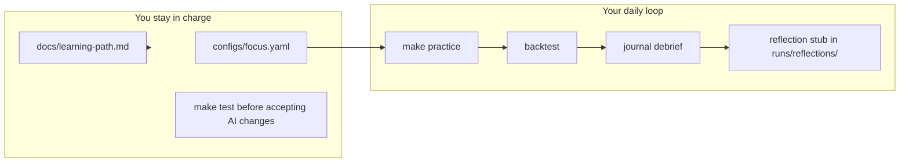

# Start-Ready Guardrails (trimmed from beginner plan)

## Verdict

**Yes, implement the guardrails plan — but not all of it at once.**

The full [beginner_learning_guardrails plan](/Users/abhoo/.cursor/plans/beginner_learning_guardrails_42e95e32.plan.md) correctly diagnoses your problem: the repo journals machine events but has no habit loop, and [`paper_btc.yaml`](configs/profiles/paper_btc.yaml) still uses `gated_skeleton` (gate rejects only, no fills to learn from). That is why accepting AI changes felt hollow.

You said everything feels overwhelming and you just want a **nicer shape to start working**. This plan delivers exactly that: **one command, one doc, one config file** — deferring exploration/commit FSM, paper guards, and [aggressive cleanup](.cursor/plans/aggressive_repo_cleanup_7f5abe36.plan.md).



---

## What we ship now (Start Pack)

| Piece | Why it matters for you |
|-------|------------------------|
| **Profile fix** | `paper_btc.yaml` → `reference` so runs produce fills + `LEARNING_RECORD`, not just `GATE_REJECT` |
| **Run slicing** | Debrief looks at **last run only**, not all 200 lines of `latest.jsonl` |
| **`journal debrief`** | Plain-English review: outcome, gate blocks, learning metrics, coaching line |
| **`practice` command** | Single entry point: backtest → debrief → reflection template → "stop here" |
| **`focus.yaml` (simple)** | One file stating which market/profile you are working on (no exploration FSM yet) |
| **`docs/learning-path.md`** | Your 1-page operating manual — not more AI plans |
| **Makefile + README** | Align defaults so docs match what you actually run |

## What we defer (Phase 2 — only after 1–2 weeks of `practice`)

From the full guardrails plan, add later when the daily loop feels natural:

- `focus commit` / `focus switch` / exploration session counters
- Paper preflight guards (`--confirm-live`, reflection-required blocks)
- `backtest_gates_only.yaml` profile (gate tuning without trades)
- Aggressive repo cleanup (delete skeleton strategies, dead symbols, etc.)
- Cursor operator rule file (optional; can add in same PR if small)

**Do not merge aggressive cleanup now.** It is engineer hygiene, not what you need to start learning.

---

## Implementation detail

### 1. Profile fix (5-minute win, do first)

Change [`configs/profiles/paper_btc.yaml`](configs/profiles/paper_btc.yaml):

```yaml
strategy_class: reference   # was gated_skeleton
```

Add missing `reference` fields from [`backtest_btc.yaml`](configs/profiles/backtest_btc.yaml) (`structure_selector: deribit`, strike_width, etc.) so paper and backtest behave consistently.

**Leave** `skeleton` / `gated_skeleton` code in place — no deletions.

### 2. Run-scoped journal slicing

Add to [`src/nautilus_zerodte/journal/service.py`](src/nautilus_zerodte/journal/service.py):

- `RunSlice` dataclass: `run_id`, `entries`, `node`, `profile` (optional)
- `slice_runs(entries) -> list[RunSlice]` — split on `LIFECYCLE` / `NODE_START` … `NODE_STOP` pairs
- `last_run(entries) -> RunSlice | None`

Enrich `NODE_START` in [`src/nautilus_zerodte/node/factory.py`](src/nautilus_zerodte/node/factory.py) `run_backtest()`:

```python
payload={
    "event": "NODE_START",
    "run_id": str(uuid4()),           # new
    "profile": str(config_path),       # new — pass path into run_backtest
    ...
}
```

Mirror `run_id` on paper `NODE_START` in [`cli/main.py`](src/nautilus_zerodte/cli/main.py) (today only set when `--streaming`).

### 3. `journal debrief` + coaching

New [`src/nautilus_zerodte/journal/debrief.py`](src/nautilus_zerodte/journal/debrief.py):

| Section | Reads | Coaching example |
|---------|-------|------------------|
| Outcome | `FILL`, `PNL`, final FSM state | "Ended InPosition — did you plan an exit?" |
| Gates | `GATE_REJECT` by rule (include `RISK_ENGINE`, `ORDER_DENIED`) | "Top block: PIN_RISK — gates did their job" |
| Learning | `LEARNING_RECORD` | edge predicted vs realized |
| Habits | derived | 3 yes/no prompts |

**Critical message when zero fills:** *"No trades this run — review gate rejects before changing strategy."*

Wire CLI in [`cli/main.py`](src/nautilus_zerodte/cli/main.py):

```bash
uv run nautilus-zerodte journal debrief --path runs/latest.jsonl
# defaults to last run; --run-id <id> for a specific run
```

### 4. Simple focus config (no exploration FSM yet)

New files:

- [`configs/focus.example.yaml`](configs/focus.example.yaml) — committed, documents BTC vs SPY tradeoff
- `configs/focus.yaml` — user's file; add to [`.gitignore`](.gitignore)

Minimal schema in [`src/nautilus_zerodte/config/focus.py`](src/nautilus_zerodte/config/focus.py):

```yaml
market: deribit_btc          # deribit_btc | ib_spy
profile: configs/profiles/backtest_btc.yaml
catalog: tests/fixtures/catalog_deribit
```

CLI (thin):

```bash
nautilus-zerodte focus init    # copies example → focus.yaml, prints tradeoff
nautilus-zerodte focus status  # shows current market + profile
```

**No** `commit`/`switch`/session counters in Start Pack — you edit `focus.yaml` manually when ready.

### 5. Reflection stub

After debrief, `practice` writes:

- `runs/reflections/<run_id>.md` (under existing `runs/` gitignore)

Template (3 prompts):

1. Why did the system take/reject trades?
2. Did I follow the plan, or try to be clever?
3. One mistake to watch next session

Optional CLI: `nautilus-zerodte reflect --run-id <id>` (create if missing, print path).

### 6. `practice` — the one daily command

New top-level command in [`cli/main.py`](src/nautilus_zerodte/cli/main.py):

```bash
make practice
# equivalent: uv run nautilus-zerodte practice
```

Sequence:

1. Load `configs/focus.yaml` — exit with `Run: nautilus-zerodte focus init` if missing
2. Run backtest with focus profile + catalog
3. Auto-run debrief on last run
4. Write reflection stub; print **"Stop here. Fill reflection before next run."**

Optional `--market ib_spy` overrides focus file for comparison runs (warn if override).

### 7. Docs and Makefile

**New** [`docs/learning-path.md`](docs/learning-path.md) (~1 page):

1. `make setup && nautilus-zerodte focus init`
2. Daily: `make practice` → read debrief → fill reflection
3. Weekly: `make test` + `journal report` to spot repeating gate blocks
4. Anti-patterns: profile hopping, editing strategy YAML before reviewing journal

Update [`README.md`](README.md) Quick start to lead with `make practice`.

Update [`Makefile`](Makefile):

```makefile
practice:   # the daily habit
review:     # journal debrief on last run
focus-init: # focus init
```

Fix misleading `backtest` target (currently uses `paper_spy.yaml`; README disagrees).

### 8. Tests (behavior that protects you)

| File | Covers |
|------|--------|
| `tests/unit/test_journal_slice.py` | `slice_runs`, `last_run` |
| `tests/unit/test_debrief.py` | fill vs no-fill coaching output |
| `tests/unit/test_focus.py` | load example, init writes yaml |
| extend `tests/unit/test_cli.py` | `practice` smoke, debrief command |

Use snippets patterned on [`runs/latest.jsonl`](runs/latest.jsonl) — no new frameworks.

---

## Your Day 1 checklist (after implementation)

You verify success without reading Python:

```bash
make test                              # must pass
nautilus-zerodte focus init            # pick a market
make practice                          # backtest + debrief + reflection path
# open runs/reflections/<run_id>.md and answer 3 questions
nautilus-zerodte journal debrief -p runs/latest.jsonl
```

**Done looks like:** debrief mentions `reference-001`, shows fills or a clear "no trades" message, and prints a reflection file path.

---

## How this keeps you in the driver's seat

| Before | After |
|--------|-------|
| AI says "implemented" → you accept | AI says "implemented" → you run `make test` + `make practice` |
| 200-line journal blob | Last-run debrief in plain English |
| Unclear which market/profile | `focus.yaml` is your declared intent |
| `gated_skeleton` gate-only runs | `reference` runs you can actually learn from |
| Many Cursor plans | One doc: `docs/learning-path.md` |

When working with Cursor after this: **one task at a time**, require the acceptance checklist (what changed, what command proves it, what trading behavior changed), and refuse bulk "implement the plan" requests.

---

## Risk notes

- `runs/` is already gitignored — reflections stay local (good for honest notes)
- `focus.yaml` is gitignored — your market choice stays personal
- Paper trading stays `dry_run: true`; Phase 2 guards add `--confirm-live` later
- Profile fix is low risk; backtest integration tests already cover `reference` on BTC/SPY fixtures
